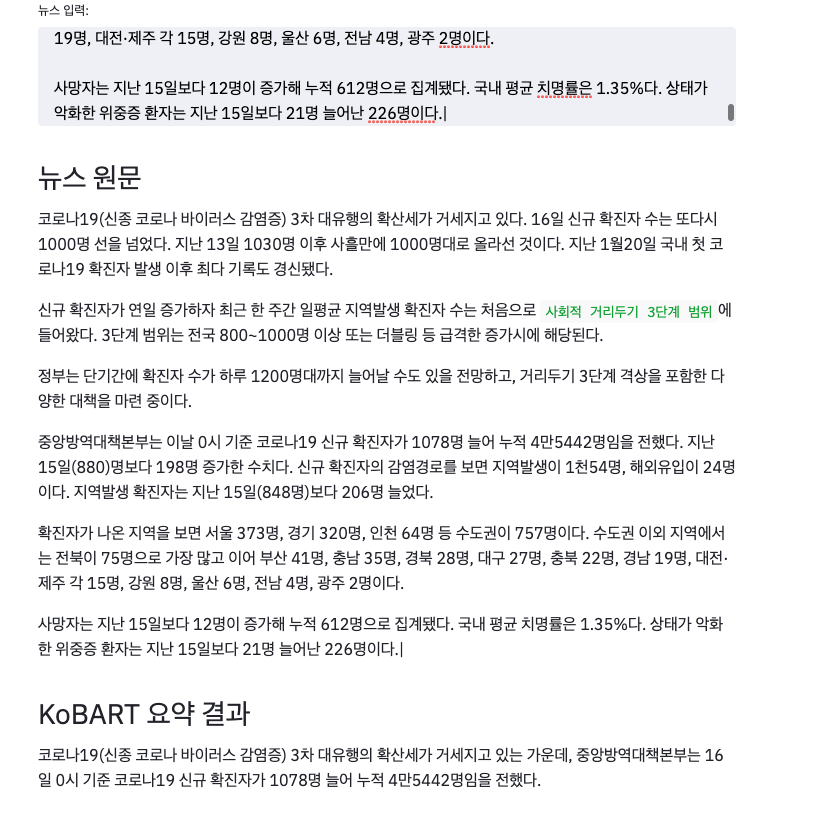

# KoBART-summarization

## Install KoBART
```
git submodule update --init --recursive
cd KoBART
pip install -r requirements.txt
pip install .
```

## Requirements
```
pytorch==1.7.0
transformers==4.0.0
pytorch-lightning==1.1.0
streamlit==0.72.0
```
## Data
- [Dacon 한국어 문서 생성요약 AI 경진대회](https://dacon.io/competitions/official/235673/overview/) 의 학습 데이터를 활용함
- 학습 데이터에서 임의로 Train / Test 데이터를 생성함
- Data 구조
    - Train Data : 34,242
    - Test Data : 8,501
  
| news  | summary |
|-------|--------:|
| 뉴스원문| 요약문 |  


## How to Train
- KoBART summarization fine-tuning
```
./prepare.sh
pip install -r requirements.txt
python train.py  --gradient_clip_val 1.0 --max_epochs 50 --default_root_dir logs  --gpus 1 --batch_size 4
```

## Model Performance
- Test Data 기준으로 rouge score를 산출함
- Score 산출 방법은 Dacon 한국어 문서 생셩요약 AI 경진대회 metric을 활용함
  
| | rouge-1 |rouge-2|rouge-l|
|-------|--------:|--------:|--------:|
| Precosion| 0.515 | 0.351|0.415|
| Recall| 0.538| 0.359|0.440|
| F1| 0.505| 0.340|0.415|

## Demo
- 학습한 model binary 추출 작업이 필요함
   - pytorch-lightning binary --> higgingface binary로 추출 작업 필요
   - hparams의 경우에는 <b>./logs/tb_logs/default/version_0/hparams.yaml</b> 파일을 활용
   - model_binary 의 경우에는 <b>./logs/kobart_summary-model_chp</b> 안에 있는 .ckpt 파일을 활용
   - 변환 코드를 실행하면 <b>./summary_binary</b> 에 model binary 가 추출 됨
  
```
 python get_model_binary.py --hparams hparam_path -- model_binary mobdl_binary_path
```

- streamlit을 활용하여 Demo 실행
    - 실행 시 <b>http://localhost:8501/</b> 로 Demo page가 실행됨
```
streamlit run infer.py
```

- Demo Page 실행 결과
  - [원문링크](https://www.mk.co.kr/news/society/view/2020/12/1289300/?utm_source=naver&utm_medium=newsstand)
  


## Reference
- [KoBART](https://github.com/SKT-AI/KoBART)
- [KoBART-chatbot](https://github.com/haven-jeon/KoBART-chatbot)